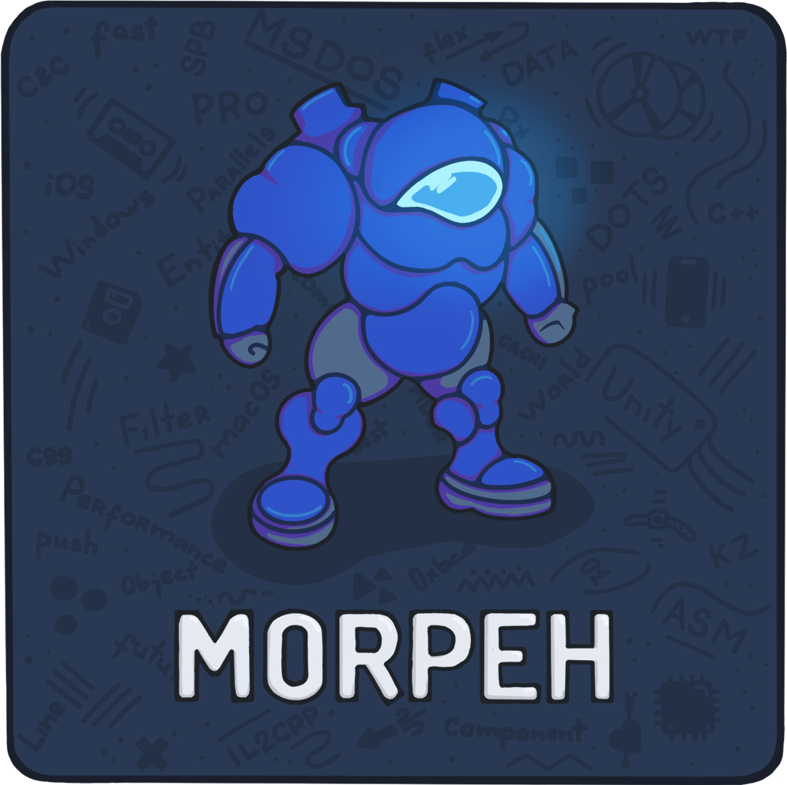

<p align="center">
    
</p>

# Morpeh [](LICENSE.md) [](https://unity.com/) [](Scellecs.Morpeh/package.json)
🎲 **ECS Framework for Unity Game Engine and .Net Platform**  

* Simple Syntax.  
* Plug & Play Installation.  
* No code generation (*yet*).  
* Structure-Based and Cache-Friendly.

Key points for people familiar with other ECS frameworks:

* Archetype-based, but stores data separately from archetypes.
 Archetypes are used only for filtering, and there's no archetype transition graph,
 which means you should not worry about performance degradation over time for lots of 
 chaotically changing entities.
* Components are stored in "stashes", which are also known as "pools" in other frameworks.
* Filters are used to select entities based on component types, but unlike
 other frameworks they should not be used in-place, and should rather be declared
 in the system OnAwake and stored in a variable.
* Filters directly store archetypes, and you can know if the filter is empty
 or not without iterating over it, possibly reducing systems idle time, especially
 in the case of a large number of systems, which is generally useful for Unity's IL2CPP.
* Designed to work well with a large quantity of different component types
 and systems in a single world (several thousands of component types and systems), but
 not necessarily with a large number of entities.
* Designed to work well in a large team with a large codebase, reducing the amount
 of things a typical developer should remember and account for. You are free
 to migrate entities by doing structural changes even if an entity contains tens of
 different components without a significant performance impact.

## 📖 Table of Contents

* [Migration](#-migration-to-new-version)
* [How To Install](#-how-to-install)
  * [Unity Engine](#unity-engine)
  * [.Net Platform](#net-platform)
* [Introduction](#-introduction)
  * [Base concept of ECS pattern](#-base-concept-of-ecs-pattern)
  * [Getting Started](#-getting-started)
  * [Advanced](#-advanced)
    * [Filter Extensions](#-filter-extensions)
    * [Filter Disposing](#-filter-disposing)
    * [Aspects](#-aspects)
    * [Component Disposing](#-component-disposing)
    * [Unity Jobs And Burst](#-unity-jobs-and-burst)
    * [Defines](#%EF%B8%8F-defines)
    * [World Plugins](#%EF%B8%8F-world-plugins)
    * [Metrics](#-metrics)
    * [Stash size](#-stash-size)
    * [Collections](#%EF%B8%8F-collections)
* [Plugins](#-plugins)
* [Examples](#-examples)
* [Games](#-games)
* [License](#-license)
* [Contacts](#-contacts)

## 🛸 Migration To New Version 

English version: [Migration Guide](MIGRATION.md)  
Russian version: [Гайд по миграции](MIGRATION_RU.md)

## 📖 How To Install 

### Unity Engine 

Minimal required Unity Version is 2020.3.*  
Requires [Git](https://git-scm.com/) for installing package.  
Requires [Tri Inspector](https://github.com/codewriter-packages/Tri-Inspector) for drawing the inspector.

<details>
    <summary>Open Unity Package Manager and add Morpeh URL.  </summary>

  

</details>

&nbsp;&nbsp;&nbsp;&nbsp;⭐ Master: https://github.com/scellecs/morpeh.git?path=Scellecs.Morpeh  
&nbsp;&nbsp;&nbsp;&nbsp;🚧 Stage:  https://github.com/scellecs/morpeh.git?path=Scellecs.Morpeh#stage-2024.1  
&nbsp;&nbsp;&nbsp;&nbsp;🏷️ Tag:  https://github.com/scellecs/morpeh.git?path=Scellecs.Morpeh#2024.1.1  

### .Net Platform

NuGet package URL: https://www.nuget.org/packages/Scellecs.Morpeh

## 📖 Introduction
### 📘 Base concept of ECS pattern

#### 🔖 Entity
An identifier for components, which does not store any data but can be used to
access components. Logically, it is similar to a GameObject in Unity, but
an Entity does not store any data itself.

It is a value type, and is trivially copyable. Underlying identifiers (IDs) are
reused, but each reused ID is guaranteed to have a new generation, making each new
Entity unique.

```c#
var healthStash = this.World.GetStash<HealthComponent>();
var entity = this.World.CreateEntity();

ref var addedHealthComponent  = ref healthStash.Add(entity);
ref var gottenHealthComponent = ref healthStash.Get(entity);

//if you remove the last entity component, it will be destroyed during the next world.Commit() call
bool removed = healthStash.Remove(entity);
healthStash.Set(entity, new HealthComponent {healthPoints = 100});

bool hasHealthComponent = healthStash.Has(entity);

var debugString = entity.ToString();

//remove entity
this.World.RemoveEntity(entity);

//check disposal
bool isDisposed = this.World.IsDisposed(entity);

//alternatively
bool has = this.World.Has(entity);
```


#### 🔖 Component
Components are types which store components data.
In Morpeh, components are value types for performance purposes.
```c#
public struct HealthComponent : IComponent {
    public int healthPoints;
}
```

#### 🔖 System

Types that process entities with a specific set of components.  
Entities are selected using a filter.

All systems are represented by interfaces.

```c#
public class HealthSystem : ISystem {
    public World World { get; set; }

    private Filter filter;
    private Stash<HealthComponent> healthStash;

    public void OnAwake() {
        this.filter = this.World.Filter.With<HealthComponent>().Build();
        this.healthStash = this.World.GetStash<HealthComponent>();
    }

    public void OnUpdate(float deltaTime) {
        foreach (var entity in this.filter) {
            ref var healthComponent = ref healthStash.Get(entity);
            healthComponent.healthPoints += 1;
        }
    }

    public void Dispose() {
    }
}
```

All systems types:  
* `IInitializer` - has OnAwake and Dispose methods only, which is convenient for executing startup logic
* `ISystem` - main system that executes every frame in Update. Used for main game logic and data processing
* `IFixedSystem` - system that executes in FixedUpdate with fixed time step
* `ILateSystem` - system that executes in LateUpdate, after all Updates. Useful for logic that should run after main updates
* `ICleanupSystem` - system that executes after ILateSystem. Designed for cleanup operations, resetting states, and handling end-of-frame tasks

Beware that ScriptableObject-based systems do still exist in 2024 version, but they are deprecated and will be removed in the future.

#### 🔖 SystemsGroup

The type that contains the systems. Consider them as a "feature" to group the systems by their common purpose.

```c#
var newWorld = World.Create();

var newSystem = new HealthSystem();
var newInitializer = new HealthInitializer();

var systemsGroup = newWorld.CreateSystemsGroup();
systemsGroup.AddSystem(newSystem);
systemsGroup.AddInitializer(newInitializer);

//it is a bad practice to turn systems off and on, but sometimes it is very necessary for debugging
systemsGroup.DisableSystem(newSystem);
systemsGroup.EnableSystem(newSystem);

systemsGroup.RemoveSystem(newSystem);
systemsGroup.RemoveInitializer(newInitializer);

newWorld.AddSystemsGroup(order: 0, systemsGroup);
newWorld.RemoveSystemsGroup(systemsGroup);
```

#### 🔖 World
A type that contains entities, components stashes, systems and root filter.
```c#
var newWorld = World.Create();
//a variable that specifies whether the world should be updated automatically by the game engine.
//if set to false, then you can update the world manually.
//and can also be used for game pauses by changing the value of this variable.
newWorld.UpdateByUnity = true;

var newEntity = newWorld.CreateEntity();
newWorld.RemoveEntity(newEntity);

var systemsGroup = newWorld.CreateSystemsGroup();
systemsGroup.AddSystem(new HealthSystem());

newWorld.AddSystemsGroup(order: 0, systemsGroup);
newWorld.RemoveSystemsGroup(systemsGroup);

var filter = newWorld.Filter.With<HealthComponent>();

var healthStash = newWorld.GetStash<HealthComponent>();
var reflectionHealthStash = newWorld.GetReflectionStash(typeof(HealthComponent));

//manually world updates
newWorld.Update(Time.deltaTime);
newWorld.FixedUpdate(Time.fixedDeltaTime);
newWorld.LateUpdate(Time.deltaTime);
newWorld.CleanupUpdate(Time.deltaTime);

//apply all entity changes, filters will be updated.
//automatically invoked between systems
newWorld.Commit();
```

#### 🔖 Filter
A type that allows filtering entities constrained by conditions With and/or Without.  
You can chain them in any order and quantity.  
Call `Build()` to finalize the filter for further use.
```c#
var filter = this.World.Filter.With<HealthComponent>()
                              .With<BooComponent>()
                              .Without<DummyComponent>()
                              .Build();

var firstEntityOrException = filter.First();
var firstEntityOrNull = filter.FirstOrDefault();

bool filterIsEmpty = filter.IsEmpty();
bool filterIsNotEmpty = filter.IsNotEmpty();
int filterLengthCalculatedOnCall = filter.GetLengthSlow();

```

#### 🔖 Stash
A type that stores components data.

```c#
var healthStash = this.World.GetStash<HealthComponent>();
var entity = this.World.CreateEntity();

ref var addedHealthComponent  = ref healthStash.Add(entity);
ref var gottenHealthComponent = ref healthStash.Get(entity);

bool removed = healthStash.Remove(entity);

healthStash.Set(entity, new HealthComponent {healthPoints = 100});

bool hasHealthComponent = healthStash.Has(entity);

//delete all HealthComponent from the world (affects all entities)
healthStash.RemoveAll();

bool healthStashIsEmpty = healthStash.IsEmpty();
bool healthStashIsNotEmpty = healthStash.IsNotEmpty();

var newEntity = this.World.CreateEntity();
//transfers a component from one entity to another
healthStash.Migrate(from: entity, to: newEntity);

//not a generic variation of stash, so we can only do a limited set of operations
var reflectionHealthCache = newWorld.GetReflectionStash(typeof(HealthComponent));

//set default(HealthComponent) to entity
reflectionHealthCache.Set(entity);

bool removed = reflectionHealthCache.Remove(entity);

bool hasHealthComponent = reflectionHealthCache.Has(entity);
```

#### 🅿️ Providers

Morpeh has providers for integration with Unity game engine.  
This is a `MonoBehaviour` that allows you to create associations between GameObject and Entity.  
For each ECS component, you can create a provider; it will allow you to change the component values directly through the inspector, use prefabs and use the workflow as close as possible to classic Unity development.  

There are two main types of providers.  
* **EntityProvider**. It automatically creates an associated entity and allows you to access it.  
* **MonoProvider**. It is an inheritor of EntityProvider, and adds a component to the entity. Allows you to view and change component values directly in the playmode.

> [!NOTE]  
> Precisely because providers allow you to work with component values directly from the kernel, because components are not stored in the provider, it only renders them;  
> We use third-party solutions for rendering inspectors like Tri Inspector or Odin Inspector.  
> It's a difficult task to render the completely different data that you can put into a component.

All providers do their work in the `OnEnable()` and `OnDisable()` methods.  
This allows you to emulate turning components on and off, although the kernel does not have such a feature.  

All providers are synchronized with each other, so if you attach several providers to one GameObject, they will be associated with one entity, and will not create several different ones.  

Providers can be inherited and logic can be overridden in the `Initialize()` and `Deinitialize()` methods.  
We do not use methods like `Awake()`, `Start()` and others, because the provider needs to control the creation of the entity and synchronize with other providers.  
At the time of calling `Initialize()`, the entity is definitely created.  

API:
```c#
var entityProvider = someGameObject.GetComponent<EntityProvider>();
var entity = entityProvider.Entity;
```

```c#
var monoProvider = someGameObject.GetComponent<MyCustomMonoProvider>();

var entity = monoProvider.Entity;
//returns serialized data or direct value of component
ref var data = ref monoProvider.GetData();
ref var data = ref monoProvider.GetData(out bool existOnEntity);
ref var serializedData = ref monoProvider.GetSerializedData();

var stash = monoProvider.Stash;
```

We also have one additional provider that allows you to destroy an entity when a GameObject is removed from the scene.  
You can simply hang it on a GameObject and no matter how many components are left on the entity, it will be deleted.  
The provider is called `RemoveEntityOnDestroy`.  

#### 🌐 World Browser

The WorldBrowser tool enables real-time tracking and searching of entities and their components. Also provides functionality to add and remove components. Works in both Unity Editor playmode and can connect remotely to builds runtime.
Supports the same filtering logic as the core ``Filter``, allowing complex queries using ``With`` and ``Without`` conditions.

Access it via Tools -> Morpeh -> WorldBrowser.

**To declare a query:**
- Enter the full component name in the search bar for ``With`` conditions.
- Use ``!`` before the component name for ``Without`` conditions (e.g. ``!ComponentName``).
- You can paste a complete regular expression directly into the search bar, and it will automatically synchronize with the list of available components.

**Alternatively:**
- Choose from a synchronized list of available components instead of typing them manually.
- Suggestions appear as you type in the search bar. When you start typing a component name, a list of available components is displayed. You can click on a suggestion to automatically complete the name.

**ID search:**
- Search by one or multiple entity IDs by entering ``id:`` (e.g. ``id:25 id:145``).
- ID-based search overrides any component-based query.

> [!NOTE]
> ``Entity`` with ID 0 cannot exist, as it's reserved as an invalid entity in the framework.

**World Selection:**
- Use the top toolbar (with the **W** icon) to choose worlds to search.
- By default, ``World.Default`` is pre-selected.

**Remote Connection:**

The feature is currently in experimental stage and works only in development builds. It has several limitations compared to Unity Editor playmode:
- Components containing `Unity.Object` are displayed in read-only mode.
- Cannot inspect `Unity.Object fields` in components, but provides `Type`, `Name`, and `InstanceID` information.
- Some components may fail serialization, will be marked with [NotSerialized] tag and won't be rendered. You'll need to modify the component structure manually if serialization is required.

Setup:
- Install [Unity.Serialization package](https://docs.unity3d.com/Packages/com.unity.serialization@3.1/manual/index.html) via Package Manager.
- Add `MORPEH_REMOTE_BROWSER` directive to *ProjectSettings -> Player -> Scripting Define Symbols*.
- Restart Unity Editor.
- After restart, the `WorldBrowser` will display a "Connect To Remote" button.

> [!IMPORTANT]  
> You must build your application after enabling remote mode. Previous builds will not support remote debugging.

Starting Remote Debug:
- Launch the application on your target device.
- Open WorldBrowser in Unity Editor.
- Enter the device's IP address (and optional port) as specified below.
- Click "Connect To Remote" button.

Android & iOS:
- Connect to the same WiFi network as your device.
- Get the device's IP address from Settings -> WiFi -> Network details.
- Enter the IP address in the connection dialog (e.g., `192.168.1.100`).
- Optionally specify a custom port (e.g., `192.168.1.100:22005`).

Windows & macOS & Linux:
- Use localhost (e.g., `127.0.0.1`).
- Optionally specify a custom port (e.g., `127.0.0.1:22005`).

---

### 📘 Getting Started
> [!IMPORTANT]  
> All GIFs are hidden under spoilers. Press ➤ to open it.

First step: install [Tri Inspector](https://github.com/codewriter-packages/Tri-Inspector).  
Second step: install Morpeh.

<details>
    <summary>After installation import ScriptTemplates and Restart Unity.  </summary>


</details>

Let's create our first component and open it.
<details>
    <summary>Right click in project window and select <code>Create/ECS/Component</code>.  </summary>


</details>


After it, you will see something like this.
```c#  
using Scellecs.Morpeh;
using UnityEngine;
using Unity.IL2CPP.CompilerServices;

[Il2CppSetOption(Option.NullChecks, false)]
[Il2CppSetOption(Option.ArrayBoundsChecks, false)]
[Il2CppSetOption(Option.DivideByZeroChecks, false)]
[System.Serializable]
public struct HealthComponent : IComponent {
}
```
> [!NOTE]  
> Don't care about attributes.  
> Il2CppSetOption attribute can give you better performance.  
> It is important to understand that this disables any checks for null, so in the release build any calls to a null object will lead to a hard crash.  
> We recommend that in places where you are in doubt about using this attribute, you check everything for null yourself.  

Add health points field to the component.

```c#  
public struct HealthComponent : IComponent {
    public int healthPoints;
}
```

It is okay.

Now let's create our first system.

Create a new C# class somewhere in your project and give it a name.

> [!NOTE]
> You can also create IFixedSystem, ILateSystem and ICleanupSystem.  
> They are similar to MonoBehaviour's Update, FixedUpdate, LateUpdate. 
> ICleanupSystem is called after all ILateSystem.

A system looks like this:
```c#  
using Scellecs.Morpeh;
using UnityEngine;
using Unity.IL2CPP.CompilerServices;

[Il2CppSetOption(Option.NullChecks, false)]
[Il2CppSetOption(Option.ArrayBoundsChecks, false)]
[Il2CppSetOption(Option.DivideByZeroChecks, false)]
public sealed class HealthSystem : ISystem {
    public World World { get; set; }
    
    public void OnAwake() {
    }

    public void OnUpdate(float deltaTime) {
    }
    
    public void Dispose() {
    }
}
```

We have to add a filter to find all the entities with `HealthComponent`.
```c#  
public sealed class HealthSystem : ISystem {
    private Filter filter;
    
    public World World { get; set; }
    
    public void OnAwake() {
        this.filter = this.World.Filter.With<HealthComponent>().Build();
    }

    public void OnUpdate(float deltaTime) {
    }
    
    public void Dispose() {
    }
}
```

> [!NOTE]  
> You can chain filters by using `With<>` and `Without<>` in any order.  
> For example `this.World.Filter.With<FooComponent>().With<BarComponent>().Without<BeeComponent>().Build();`

> [!IMPORTANT]  
> Components are structs and if you want to change their values, then you must use `ref`.
> It is recommended to always use `ref` unless you specifically need a copy of the component.

Now we can iterate over our entities.
```c#  
public sealed class HealthSystem : ISystem {
    public World World { get; set; }
    
    private Filter filter;
    private Stash<HealthComponent> healthStash;
    
    public void OnAwake() {
        this.filter = this.World.Filter.With<HealthComponent>().Build();
        this.healthStash = this.World.GetStash<HealthComponent>();
    }

    public void OnUpdate(float deltaTime) {
        foreach (var entity in this.filter) {
            ref var healthComponent = ref healthStash.Get(entity);
            Debug.Log(healthComponent.healthPoints);
        }
    }
    
    public void Dispose() {
    }
}
```

Now we need to add our newly created system to the world. We can do it by creating a `SystemGroup` and adding the system to it,
and then adding the `SystemGroup` to the world.

World.Default is created for you by default, but you can create your own worlds if you need to separate the logic.
Beware that World.Default is updated automatically by the game engine, but you can disable it and update it manually.
Custom worlds are not updated automatically, so you need to update them manually.

```c#
public class Startup : MonoBehaviour {
    private World world;
    
    private void Start() {
        this.world = World.Default;
        
        var systemsGroup = this.world.CreateSystemsGroup();
        systemsGroup.AddSystem(new HealthSystem());
        
        this.world.AddSystemsGroup(order: 0, systemsGroup);
    }
}
```

Attach the script to any GameObject and press play.

Nothing happened because we did not create our entities.  

We will focus on `GameObject`-based API because otherwise all you need to do is create an entity with `World.CreateEntity()`.
To do this, we need a provider that associates a `GameObject` with an entity.

Create a new provider.

<details>
    <summary>Right click the project window and select <code>Create/ECS/Provider</code>.  </summary>


</details>

```c#  
using Scellecs.Morpeh.Providers;
using Unity.IL2CPP.CompilerServices;

[Il2CppSetOption(Option.NullChecks, false)]
[Il2CppSetOption(Option.ArrayBoundsChecks, false)]
[Il2CppSetOption(Option.DivideByZeroChecks, false)]
public sealed class HealthProvider : MonoProvider<{YOUR_COMPONENT}> {
}
```

We need to specify a component for the provider.
```c#  
public sealed class HealthProvider : MonoProvider<HealthComponent> {
}
```

<details>
    <summary>Create new GameObject and add <code>HealthProvider</code>.  </summary>


</details>

Now press play button, and you will see Debug.Log with healthPoints.  
Nice!

---

### 📖 Advanced

#### 🧩 Filter Extensions

Filter extensions are a way to reuse queries or their parts.
Let's look at an example:  

Create a struct and implement the IFilterExtension interface.

```c#  
public struct SomeExtension : IFilterExtension {
    public FilterBuilder Extend(FilterBuilder rootFilter) => rootFilter.With<Translation>().With<Rotation>();
}
```

The next step is to call the Extend method in any order when requesting a filter.  
The Extend method continues query.

```c#  
private Filter filter;

public void OnAwake() {
    this.filter = this.World.Filter.With<TestA>()
                                   .Extend<SomeExtension>()
                                   .With<TestC>()
                                   .Build();
}
```

#### 🧹 Filter Disposing
`Filter.Dispose` allows you to completely remove the filter from the world, as if it never existed there.

> [!IMPORTANT]
> `Filter.Dispose` removes all filter instances across all systems where it was used, not just the instance on which `Dispose` was called.

#### 🔍 Aspects
An aspect is an object-like wrapper that you can use to group a subset of an entity's components together into a single C# struct.
Aspects are useful for organizing components code and simplifying queries in your systems.  

For example, the Transform aspect groups together the position, rotation, and scale of components and enables you to access these components from a query that includes the Transform.
You can also define your own aspects with the IAspect interface.  

Components:
```c#  
    public struct Translation : IComponent {
        public float x;
        public float y;
        public float z;
    }
    
    public struct Rotation : IComponent {
        public float x;
        public float y;
        public float z;
        public float w;
    }

    public struct Scale : IComponent {
        public float x;
        public float y;
        public float z;
    }
```

Let's group them in an aspect:

```c#  
public struct Transform : IAspect {
    //Set on each call of AspectFactory.Get(Entity entity)
    public Entity Entity { get; set; }
    
    private Stash<Translation> translation;
    private Stash<Rotation> rotation;
    private Stash<Scale> scale;
    
    public ref Translation Translation => ref this.translation.Get(this.Entity);
    public ref Rotation Rotation => ref this.rotation.Get(this.Entity);
    public ref Scale Scale => ref this.scale.Get(this.Entity);

    //Called once on world.GetAspectFactory<T>
    public void OnGetAspectFactory(World world) {
        this.translation = world.GetStash<Translation>();
        this.rotation = world.GetStash<Rotation>();
        this.scale = world.GetStash<Scale>();
    }
}
```

Let's add an IFilterExtension implementation to always have a query.

```c#  
public struct Transform : IAspect, IFilterExtension {
    public Entity Entity { get; set;}
    
    public ref Translation Translation => ref this.translation.Get(this.Entity);
    public ref Rotation Rotation => ref this.rotation.Get(this.Entity);
    public ref Scale Scale => ref this.scale.Get(this.Entity);
    
    private Stash<Translation> translation;
    private Stash<Rotation> rotation;
    private Stash<Scale> scale;

    public void OnGetAspectFactory(World world) {
        this.translation = world.GetStash<Translation>();
        this.rotation = world.GetStash<Rotation>();
        this.scale = world.GetStash<Scale>();
    }
    public FilterBuilder Extend(FilterBuilder rootFilter) => rootFilter.With<Translation>().With<Rotation>().With<Scale>();
}
```

Now we write a system that uses our aspect.

```c#  
public class TransformAspectSystem : ISystem {
    public World World { get; set; }

    private Filter filter;
    private AspectFactory<Transform> transform;
    
    private Stash<Translation> translation;
    private Stash<Rotation> rotation;
    private Stash<Scale> scale;
    
    public void OnAwake() {
        //Extend filter with ready query from Transform
        this.filter = this.World.Filter.Extend<Transform>().Build();
        //Get aspect factory AspectFactory<Transform>
        this.transform = this.World.GetAspectFactory<Transform>();

        
        for (int i = 0, length = 100; i < length; i++) {
            var entity = this.World.CreateEntity();
            
            ref var translationComponent = ref this.translation.Set(entity);
            ref var rotationComponent = ref this.rotation.Set(entity);
            ref var scaleComponent = ref this.scale.Set(entity);
        }
    }
    public void OnUpdate(float deltaTime) {
        foreach (var entity in this.filter) {
            //Getting aspect copy for current entity
            var trs = this.transform.Get(entity);

            ref var trans = ref trs.Translation;
            trans.x += 1;

            ref var rot = ref trs.Rotation;
            rot.x += 1;
            
            ref var scale = ref trs.Scale;
            scale.x += 1;
        }
    }
    
    public void Dispose() {
    }
}
```

#### 🧹 Component Disposing

> [!IMPORTANT]  
> Make sure you don't have the `MORPEH_DISABLE_COMPONENT_DISPOSE` define enabled.  

Sometimes it becomes necessary to clear component values.
For this, it is enough that a component implements `IDisposable`. For example:

```c#  
public struct PlayerView : IComponent, IDisposable {
    public GameObject value;
    
    public void Dispose() {
        Object.Destroy(value);
    }
}
```

An initializer or a system needs to mark the stash as disposable. For example:

```c# 
public class PlayerViewDisposeInitializer : IInitializer {
    public void OnAwake() {
        this.World.GetStash<PlayerView>().AsDisposable();
    }
    
    public void Dispose() {
    }
}
```

or

```c# 
public class PlayerViewSystem : ISystem {
    public void OnAwake() {
        this.World.GetStash<PlayerView>().AsDisposable();
    }
    
    public void OnUpdate(float deltaTime) {
        ...
    }
    
    public void Dispose() {
    }
}
```

Now, when the component is removed from an entity, the `Dispose()` method
will be called on the `PlayerView` component.  

####  🧨 Unity Jobs And Burst

> [!IMPORTANT]  
> Supported only in Unity. Subjected to further improvements and modifications.

You can convert `Filter` to `NativeFilter` which allows you to do component-based manipulations inside a Job.  
Conversion of `Stash<T>` to `NativeStash<TNative>` allows you to operate on components based on entity ids.  

Current limitations:
* `NativeFilter` and `NativeStash` and their contents should never be re-used outside of single system tick.
* `NativeFilter` and `NativeStash` cannot be used in-between `World.Commit()` calls inside Morpeh.

Example job scheduling:
```c#  
public sealed class SomeSystem : ISystem {
    private Filter filter;
    private Stash<HealthComponent> stash;
    ...
    public void OnUpdate(float deltaTime) {
        var nativeFilter = this.filter.AsNative();
        var parallelJob = new ExampleParallelJob {
            entities = nativeFilter,
            healthComponents = stash.AsNative(),
            // Add more native stashes if needed
        };
        var parallelJobHandle = parallelJob.Schedule(nativeFilter.length, 64);
        parallelJobHandle.Complete();
    }
}
```

Example job:
```c#
[BurstCompile]
public struct TestParallelJobReference : IJobParallelFor {
    [ReadOnly]
    public NativeFilter entities;
    public NativeStash<HealthComponent> healthComponents;
        
    public void Execute(int index) {
        var entity = this.entities[index];
        
        ref var component = ref this.healthComponents.Get(entity, out var exists);
        if (exists) {
            component.Value += 1;
        }
        
        // Alternatively, you can avoid checking existance of the component
        // if the filter includes said component anyway
        
        ref var component = ref this.healthComponents.Get(entity);
        component.Value += 1;
    }
}
```

For flexible Job scheduling, you can use `World.JobHandle`.  
It allows you to schedule Jobs within one SystemsGroup, rather than calling `.Complete()` directly on the system.  
Planning between SystemsGroup is impossible because in Morpeh, unlike Entities or other frameworks, there is no dependency graph that would allow Jobs to be planned among all systems, taking into account dependencies.  


Example scheduling:
```c#  
public sealed class SomeSystem : ISystem {
    private Filter filter;
    private Stash<HealthComponent> stash;
    ...
    public void OnUpdate(float deltaTime) {
        var nativeFilter = this.filter.AsNative();
        var parallelJob = new ExampleParallelJob {
            entities = nativeFilter,
            healthComponents = stash.AsNative()
        };
        World.JobHandle = parallelJob.Schedule(nativeFilter.length, 64, World.JobHandle);
    }
}
```

`World.JobHandle.Complete()` is called automatically after each Update type.
For example:
* Call OnUpdate() on all systems within the SystemsGroup.
* Call World.JobHandle.Complete().
* Call OnFixedUpdate() on all systems within the SystemsGroup.
* Call World.JobHandle.Complete().

> [!WARNING]  
> You cannot change the set of components on any entities if you have scheduled Jobs.  
> Any addition or deletion of components is considered a change.  
> The kernel will warn you at World.Commit() that you cannot do this.  

You can manually control `World.JobHandle`, assign it, and call `.Complete()` on systems if you need to.  
Currently Morpeh uses some additional temporary collections for the native part, so instead of just calling `World.JobHandle.Complete()` we recommend using `World.JobsComplete()`.  
This method is optional; the kernel will clear these collections one way or another, it will simply do it later.

####  🗒️ Defines

Can be set by user:
* `MORPEH_DEBUG` Define if you need debug in application build. In editor it works automatically.
* `MORPEH_EXTERNAL_IL2CPP_ATTRS` If you have conflicts with attributes, you can set this define and Morpeh core will be use internal version of attributes.
* `MORPEH_PROFILING` Define for systems profiling in Unity Profiling Window.
* `MORPEH_METRICS` Define for additional Morpeh Metrics in Unity Profiling Window.
* `MORPEH_NON_SERIALIZED` Define to avoid serialization of Morpeh core parts.
* `MORPEH_THREAD_SAFETY` Define that forces the kernel to validate that all calls come from the same thread the world was created on. The binding to a thread can be changed using the `World.GetThreadId()`, `World.SetThreadId()` methods.
* `MORPEH_DISABLE_SET_ICONS` Define for disabling set icons in Project Window.
* `MORPEH_DISABLE_AUTOINITIALIZATION` Define for disable default world creation and creating Morpeh Runner GameObject.
* `MORPEH_DISABLE_COMPILATION_REPORT` Define for disable compilation report in Editor Console.
* `MORPEH_DISABLE_COMPONENT_DISPOSE` Define to disable component disposing feature.
Will be set by framework:
* `MORPEH_BURST` Determine if Burst is enabled, and framework has enabled Native API.
* `MORPEH_GENERATE_ALL_EXTENDED_IDS` to generate `ExtendedComponentId` for all components even outside of Unity Editor.

####  🌍️ World Plugins

Sometimes you need to make an automatic plugin for the world.  
Add some systems, make a custom game loop, or create your own automatic serialization.  
World plugins are great for this.  

To do this, you need to declare a class that implements the IWorldPlugin interface.  
After that, create a static method with an attribute and register the plugin in the kernel.  

For example:
```c#
class GlobalsWorldPlugin : IWorldPlugin {

    [RuntimeInitializeOnLoadMethod(RuntimeInitializeLoadType.SubsystemRegistration)]
    public static void RuntimeInitialize() {
        WorldExtensions.AddWorldPlugin(new GlobalsWorldPlugin());
    }
    
    public void Initialize(World world) {
        var sg = world.CreateSystemsGroup();
        sg.AddSystem(new ECS.ProcessEventsSystem());
        world.AddPluginSystemsGroup(sg);
    }
    
    public void Deinitialize(World world) {
        
    }
}
```

####  📊 Metrics
To debug the game, you may need statistics on basic data in the ECS framework, such as:

1. Number of entities
2. Number of archetypes
3. Number of filters
4. Number of systems
5. Number of commits in the world
6. Number of entity migrations
7. Number of stash resizes

You can find all this in the profiler window.  
To do this, you need to add the official **Unity Profiling Core API** package to your project.  
Its quick name to search is: `com.unity.profiling.core`  

After this, specify the `MORPEH_METRICS` definition in the project.  
Now you can observe all the statistics for the kernel.  

Open the profiler window.  
On the top left, click the Profiler Modules button and find Morpeh there.  
We turn it on with a checkmark and can move it higher or lower. 

Metrics work the same way in debug builds, so you can see the whole picture directly from the device.

<details>
    <summary>It will be look like this in playmode. </summary>


</details>


#### 📏 Stash size

If you know the expected number of components in a stash, you have the option to set a base size to prevent resizing and avoid unnecessary allocations.

```c#
ComponentId<T>.StashSize = 1024;
```

This value is not tied to a specific ``World``, so it needs to be set before starting ECS, so that all newly created stashes of this type in any ``World`` have the specified capacity.

#### ⚙️ Collections

Morpeh provides a small set of custom lightweight collections that perform faster under IL2CPP compared to standard library collections.

**FastList**

Identical to List<T>, additionally supports RemoveSwapBack operations and provides more control over the internal list structure. Also includes methods that allow bypassing array bounds checking.

**IntHashMap & LongHashMap**

Identical to Dictionary<int, T> and Dictionary<long, T> respectively, but only supports positive range of keys. Significantly outperforms the dictionary in terms of performance. Allows getting elements by ref. Use combination of ``foreach`` and ``GetValueByIndex/GetValueRefByIndex`` to iterate over the map.

**IntHashSet**

Lightweight version of HashSet<int>. Has similar optimizations to IntHashMap but without value storage overhead. Supports only positive range of keys.

**BitSet**

Optimized lightweight implementation of a bit array, resizes significantly faster.

---

## 🔌 Plugins

* [**Morpeh Helpers**](https://github.com/SH42913/morpeh.helpers)
* [**Morpeh.Events**](https://github.com/codewriter-packages/Morpeh.Events)
* [**Morpeh.SystemStateProcessor**](https://github.com/codewriter-packages/Morpeh.SystemStateProcessor)
* [**Morpeh.Queries**](https://github.com/actionk/Morpeh.Queries)
* [**Morpeh.SourceGenerator**](https://github.com/kandreyc/Scellecs.Morpeh.SourceGenerator)
* [**Morpeh.Addons**](https://github.com/MexicanMan/morpeh.addons)
* [**PlayerLoopAPI Runner Morpeh plugin**](https://github.com/skelitheprogrammer/PlayerLoopCustomizationAPI.Runner.Morpeh-Plugin)

---

## 📚 Examples

* [**Tanks**](https://github.com/scellecs/morpeh.examples.tanks) by *SH42913*  
* [**Ping Pong**](https://github.com/scellecs/morpeh.examples.pong) by *SH42913*  
* [**Flappy Bird**](https://github.com/R1nge/MorpehECS_FlappyBird) by *R1nge*        
* [**3D Asteroids**](https://github.com/R1nge/MorpehECS_3D_Asteroids) by *R1nge*    
* [**Mobile Runner Hypercasual**](https://github.com/StinkySteak/unity-morpeh-hypercasual) by *StinkySteak*

---

## 🔥 Games

* **One State RP - Life Simulator** by *Chillbase*  
  [Android](https://play.google.com/store/apps/details?id=com.Chillgaming.oneState) [iOS](https://apps.apple.com/us/app/one-state-rp-online/id1597760047)

* **FatalZone** by *Midhard Games*  
  [Steam](https://store.steampowered.com/app/2488510/FatalZone/)


* **Zombie City** by *GreenButtonGames*  
  [Android](https://play.google.com/store/apps/details?id=com.greenbuttongames.zombiecity) [iOS](https://apps.apple.com/us/app/zombie-city-master/id1543420906)


* **Fish Idle** by *GreenButtonGames*  
  [Android](https://play.google.com/store/apps/details?id=com.greenbuttongames.FishIdle) [iOS](https://apps.apple.com/us/app/fish-idle-hooked-tycoon/id1534396279)


* **Stickman of Wars: RPG Shooters** by *Multicast Games*  
  [Android](https://play.google.com/store/apps/details?id=com.multicastgames.sow3) [iOS](https://apps.apple.com/us/app/stickman-of-wars-rpg-shooters/id1620422798)


* **Alien Invasion: RPG Idle Space** by *Multicast Games*  
  [Android](https://play.google.com/store/apps/details?id=com.multicastgames.venomSurvive) [iOS](https://apps.apple.com/tr/app/alien-invasion-rpg-idle-space/id6443697602)


* **Cowravaneer** by *FESUNENKO GAMES*  
  [Android](https://play.google.com/store/apps/details?id=com.FesunenkoGames.Cowravaneer)

---

## 📘 License

📄 [MIT License](LICENSE.md)

---

## 💬 Contacts

✉️ Telegram: [olegmrzv](https://t.me/olegmrzv)  
📧 E-Mail: [benjminmoore@gmail.com](mailto:benjminmoore@gmail.com)  
👥 Telegram Community RU: [Morpeh ECS Development](https://t.me/morpeh_development_chat)
